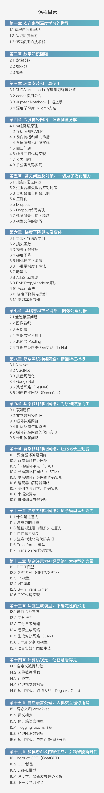

# 《深度学习必修课：进击算法工程师》配套代码

## 简介

课程总共16章100节，会帮你打牢深度学习基础，包括必要数学概念和代码工具，从最简单的多层感知机开始，循着深度学习的发展脉络带你掌握CNN、RNN及其各种变体。同时会带你熟悉业界前沿技术，包括注意力机制、概率图模型、迁移学习等核心知识。最后还会有计算机视觉、自然语言处理和多模态AI内容生成方面最新模型和实战介绍，手把手带你实现贴合工业界需求的案例项目。

## 相关内容

[B站](https://space.bilibili.com/1921388479) [知乎](https://www.zhihu.com/people/qiu-qiu-27-64-51) [课程链接](https://appmixy0usl5902.h5.xiaoeknow.com)

